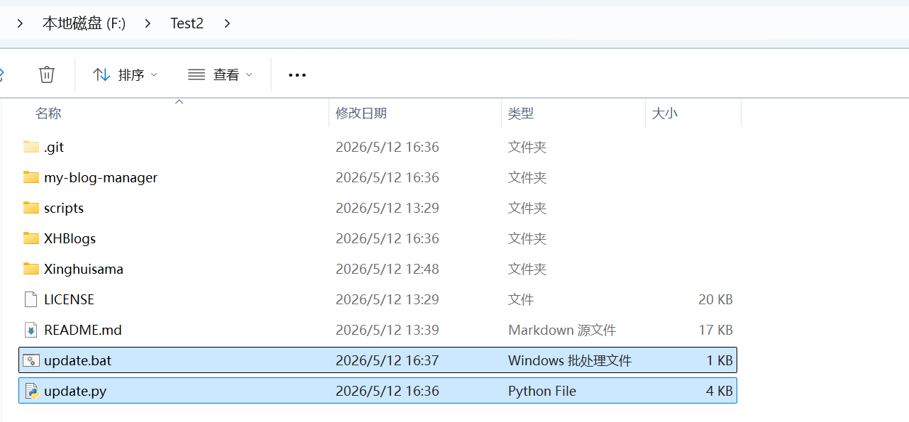
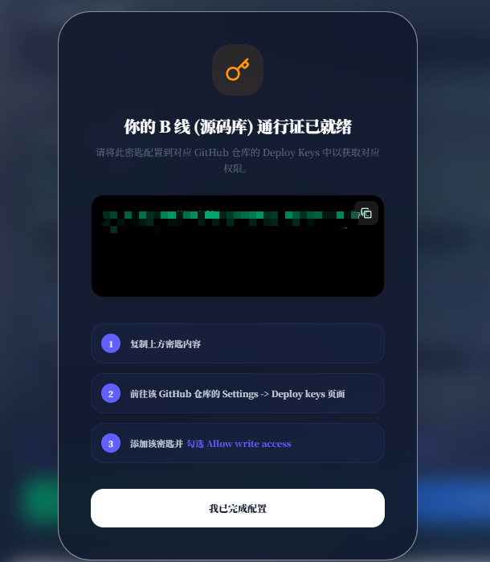
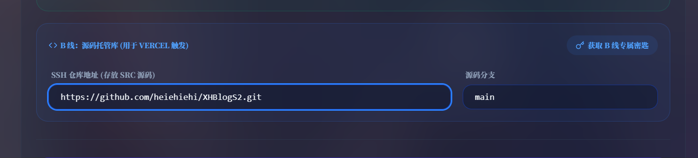
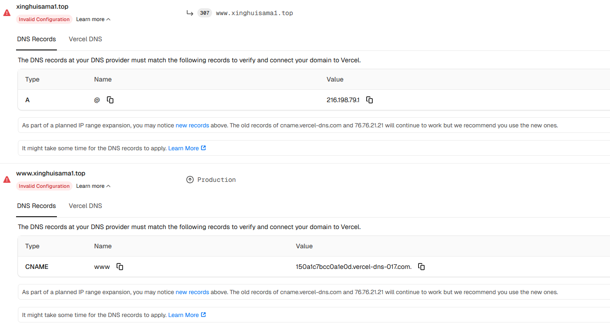
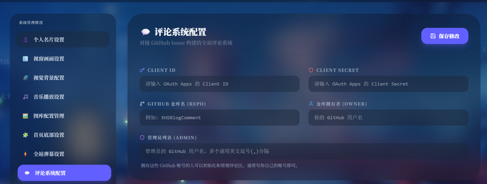

# 🌟 欢迎使用 yukiBlogs！

这是一个采用 Next.js 构建的高颜值、毛玻璃（Glassmorphism）风格个人博客系统。本项目自带完善的前端展示与独立的本地后台控制台，支持 Markdown 沉浸式写作、草稿管理以及便捷的图床配置。

本指南将带你从零开始，轻松部署并使用 yukiBlogs。

> **部署架构**：`myBlogs` 包含 AI、天气、音乐和 OAuth 等服务端路由，需要 Vercel 或其他 Next.js 服务端运行时。GitHub 仅用于托管源码，不直接发布 GitHub Pages 静态站点。

感谢 https://github.com/heiehiehi/XinghuisamaBlogs XH大佬的开源项目

---
## 语言

[](README_en.md)
[](README.md)

## 隐私与仓库安全

本仓库只跟踪可复用源码。个人配置、部署路径、文章、杂谈、相册、友链、项目数据、上传文件和自定义域名均在首次运行时本地生成，并由 Git 忽略。发布前请运行 `node scripts/checkPublicRepo.mjs`；API Key、OAuth Client Secret 和统计密钥必须保存在本地或部署平台的环境变量中。

## 写在前面

### 更新摘要（2026-08-19）

#### 1. 新增持久化访问统计

> 使用 Upstash Redis 保存累计访客和文章、杂谈、说说浏览次数。迁移、每日去重和累计递增通过 Redis Lua 原子完成；旧版文章阅读数会在首次读取时自动迁移。

#### 2. 支持站长浏览器排除与机器人过滤

> 配置 `STATS_OWNER_KEY` 后，可在 `/stats-owner` 将当前浏览器标记为站长浏览器；站长访问和常见爬虫不会新增统计记录，启用排除前已有的累计数保持不变。

#### 3. 修复控制台配置与前台显示不同步

> 统一运行时配置读取，修复友链、个人资料、页脚技术栈、建站时间、AI 设置、项目/相册及杂谈等内容保存后仍显示旧数据的问题，同时加强删除、重试与生成文件写入流程。

#### 4. 改进 Windows 启动、部署与密钥管理

> `Start.bat` 现在优先使用 uv 创建的 `.venv`；GitHub OAuth、Gemini、天气与统计密钥改由服务端环境变量提供。当前前端技术栈为 Next.js 16、React 19 与 Tailwind CSS 4。

## 一、快速开始部署

### 1. 环境配置

在开始之前，请确保你的电脑已安装以下运行环境，否则后续程序将无法正常启动：

- **Node.js** (最低 v20.9.0，推荐当前 LTS)
- **包管理器** (npm)
- **Git** (用于拉取代码与版本控制)
- **Python** (建议版本 3.10 及以上，本系统在 3.10 环境下测试通过)
- *可选：云存储/图床服务（后续会有详细配置说明）*

### 2. 博客源码更新

为了让你能轻松跟上项目的最新功能，请使用更新器对源码进行更新！
使用更新器，你不需要再手动对比代码、不用担心拉取更新会引发冲突，更不用害怕辛辛苦苦写的文章和配置文件被覆盖！

🛠️ 更新步骤：

第一步：获取无损更新器 (仅首次需要)

#### 1 下载项目根目录下的 update.bat 和 update.py 文件。

#### 2  将下载好的 update.bat 和 update.py 移动到你本地博客项目的最外层根目录（也就是和 my-blog-manager、myBlogs 文件夹放在一起的地方）。

如下图所示



#### 3 双击update.bat文件实现更新，如果闪退 请使用cmd运行update.py文件

### 3. 快速开始

#### ① 启动脚本

当你完成上述环境的配置后，恭喜你，最基础的准备工作已经搞定了！
首先，进入 `my-blog-manager` 文件夹（**⚠️ 注意：请绝对不要重命名此文件夹，否则会导致环境路径解析失败！**）

推荐先创建并同步 uv 环境：

```powershell
cd my-blog-manager
uv sync --python 3.12
uv run python run_me.py
```

之后也可直接双击 `Start.bat`，启动脚本会优先使用 `.venv\Scripts\python.exe`。

双击运行文件夹中的启动脚本：
`Start.bat`
脚本会自动检测并安装所需的依赖包。等待环境配置完成后，程序会自动唤起精美的后台控制台。

#### ② 部署你的博客到 Vercel

> **提示**：本教程主要演示如何将项目部署至 Vercel，因为 Vercel 对 Next.js 框架有着最顶级的原生支持。
>
> **前提**：请确保已安装 Git，并拥有一个 GitHub 账号。**接下来的步骤请务必按顺序操作！**

> **请确保你已完成以下操作**：
>
> **第一步：本地全局配置**

设置用户名

`git config --global user.name "你的Github用户名"`

设置邮箱（必须是你在 GitHub 绑定的邮箱）

`git config --global user.email "你绑定在Github的邮箱@example.com"`

> **第二步：初始化本地仓库**
>
> 进入你的项目文件夹，执行以下CMD命令行操作：(及前端部署文件夹，这里是myBlogs)

1. 初始化 Git 仓库，生成隐藏的 .git 文件夹
   `git init`
2. 将所有文件添加到暂存区（注意后面有个点）
   `git add .`
3. 提交到本地版本库，并添加备注
   `git commit -m "first commit"`

**1. 配置本地物理路径**
打开控制台的“设置”页面。
在拉取的源码中，包含 `my-blog-manager` 和 `myBlogs` 两个核心文件夹。请在控制台中指定 `myBlogs` 的本地物理路径。


例如：`D:\Sites\yukiBlogs`


> **关键步骤**：填入路径后，请务必点击 **[测试路径]** 进行连通性验证！！！验证通过后，再点击下方的 **[保存部署配置]**。

**2. 在 GitHub 创建私有仓库**
登录 GitHub，新建一个用于托管博客源码的仓库（建议设置为 **Private 私有仓库** 以保护数据隐私）。


仓库名称可自定义。


获取该仓库的 SSH 地址，并将其复制粘贴到控制台的“源码仓库”配置中：


源码分支填写为 `main`。确认无误后，再次点击 **[保存部署配置]**。

**3. 获取并配置部署密钥**
点击控制台中的 **[获取源码仓库专属密钥]** 按钮：



进入你的 GitHub 仓库页面，导航至 `Settings` -> `Deploy keys` 界面：


将刚才复制的密钥填入 `Key` 框中，`Title` 可随意命名（例如：`myBlogs-Deploy-Key`）。

> **🚨 严重警告**：下方的 **Allow write access** 选项必须勾选！！！
> 设置完毕后，点击 **Add key** 保存。

**4. 初始化并推送源码**
返回本地控制台，点击 **[初始化源码部署环境]**，静待程序执行完毕。
完成后，点击 **[同步源码到 Vercel]** 按钮：


程序将开始向 GitHub 推送代码。**在此期间，请千万不要切换页面或关闭窗口**：


进度条完成后，说明前端静态页面源码已成功托管至 GitHub。

> **此处可能出现无法推送bug**：
>
> **请尝试**
>
> 将SSH仓库地址改成如下图所示再进行初始化及同步源码
>
> 

**5. 部署至 Vercel 平台**
访问 Vercel 官网，注册账号并绑定你的 GitHub 授权！


点击 `Add New...` 添加一个新的 Project，在 Import 列表中选择你刚刚推送到 GitHub 的仓库：


例如我选择的是 `myBlogS2`：


在 Framework Preset（框架预设）中选择 **Next.js**，然后点击 **Deploy** 按钮开始部署：


静候 Vercel 服务器构建你的博客~~


撒花！部署成功后，点击预览图即可直接访问你的专属网站！


在项目仪表盘（Dashboard）中，你可以随时查看部署状态与详细日志：


Vercel 默认会为你分配一个免费的二级域名：


---

### 问题 1：我要怎么样绑定自己的专属域名？

**答：** 这里以“阿里云”购买的域名为例（其他服务商如腾讯云、Cloudflare 等操作逻辑基本一致）。

首先登录阿里云控制台，进入【域名管理】页面：


点击对应域名右侧的【解析】按钮：


接着回到 Vercel，进入你的项目仪表盘，点击 **Settings**（或者直接点击域名旁的加号）：


在 Domains 选项卡中，输入你购买的域名（例如我的是 `xinghuisama.top`），点击 **Add** 保存：



添加后，Vercel 会提供 `A` 记录和 `CNAME` 记录的配置参数。请将这些参数完整添加到阿里云的 DNS 解析设置中：


> **注意**：添加记录时，请务必仔细核去记录类型和记录值（Value）！

配置完成后等待几分钟（DNS 传播需要时间），在 Vercel 页面点击 **Refresh** 刷新状态！！


当状态显示为正常后，你就可以通过自己的专属域名访问博客了！（例如：`www.xinghuisama.top`）。

---

## 二、更新设置及上传文件

为了保护数据安全，本控制台采用了**“操作暂存区”**机制。**请特别注意！！** 许多设置在修改后，必须主动执行“更新到本地”才能真正保存。需要执行此操作时，界面上方通常会有高亮提示。

**操作示例：修改个人简介**


修改内容后，点击 **[暂存到操作队列]**：


此时上方工具箱会提示待办操作。你可以随时撤销（清空全部），或者点击 **[更新本地]**。

> ⚠️ 注意：点击“更新本地”后，数据仅仅保存在了你的本地控制台环境中。

如果你希望让这些修改在前端博客页面生效，你必须继续点击 **[同步 Blog]**（前提是前端博客的物理路径已正确配置）：


博客文章、说说（碎碎念）、杂谈等所有内容的发布与修改，均遵循此流程。

> **💡 黄金法则**：暂存队列 -> 更新本地 -> 同步Blog

---

## 三、如何推送你的修改到线上网页？

当你在本地完成了满意的创作或设置调整，想要将其发布到公网让所有人看到时：

请牢记，在执行了任何实质性修改并点击 **[同步Blog]** 后，请打开控制台的同步部署页面：


确认“源码仓库”地址正确无误，点击 **[同步源码到 Vercel]**。
等待 GitHub Actions 或 Vercel 自动捕获更新。稍作喝杯茶的功夫，你就能在线上页面看到最新鲜的内容了！

---

## 四、图床配置

为了优化写作体验，控制台深度整合了图床上传功能。本指南推荐使用“去不图床”（[https://7bu.top](https://7bu.top)）。
如果你习惯使用纯外链，工具台也完美支持直接插入图片 URL。如果想接入其他支持标准 API 的图床，也欢迎极客们自行尝试。

**配置流程：**


填入对应的 API Token 等信息后，你可以点击 **[发送探针测试Token]**，实时检验图床接口是否畅通。

---

## 五、AI 猫猫助理设置

博客系统内置了一只聪明的 AI 猫猫助理（默认接入 Gemini 模型）。极客玩家也可以通过修改源码接入其他大语言模型。

首先，你需要申请一个 Gemini 的 API Key（申请教程网络资源丰富，在此不赘述）。拿到 API Key 后，在控制台进行如下配置：


在本地设定好猫猫的专属系统提示词（性格）后，我们需要让线上环境也拥有调用 AI 的能力。请登录 Vercel：


在项目设置中找到 `Environment Variables`（环境变量）：


进入你的博客工程详情：


确保作用域（环境）包含线上环境，点击 **Add Environment Variables**：


安全地注入你的密钥：

线上环境至少需要配置：

| 环境变量 | 用途 |
| --- | --- |
| `GEMINI_API_KEY` | AI 猫猫助理 |
| `QWEATHER_KEY` | 天气挂件服务端路由 |
| `GITHUB_OAUTH_CLIENT_SECRET` | GitHub 评论 OAuth 的服务端交换 |
| `KV_REST_API_URL` | Upstash Redis REST 地址，用于访问统计 |
| `KV_REST_API_TOKEN` | Upstash Redis REST 写入令牌，仅保存在服务端 |
| `STATS_OWNER_KEY` | 站长统计排除密钥，请使用随机长字符串 |


点击保存。下一次重新部署时，猫猫助理就会在线上苏醒了。

---

## 六、评论系统配置

本博客的评论系统基于 GitHub Issues（Gitalk 等类似方案）。你需要在 GitHub 创建一个 **Public（公开）** 仓库来专门存储网友的留言。

在控制台评论设置中，填入你的 GitHub 用户名以及这个公开仓库的名称：



**接下来，配置 OAuth 授权以允许访客登录留言：**

1. 登录 GitHub，点击右上角个人头像，进入 **Settings**（设置）。
2. 滑动到左侧菜单栏最底部，点击 **Developer settings**。
3. 在左侧选择 **OAuth Apps**，点击右上角的 **New OAuth App**。

**关键应用信息填写指南：**


| 字段名称                       | 填写建议                                                                           |
| ------------------------------ | ---------------------------------------------------------------------------------- |
| **Application name**           | 自定义名称，例如：`My-Blog-Comments`                                               |
| **Homepage URL**               | 你的博客**首页完整地址** (例如 `https://www.xinghuisama.top`)                      |
| **Application description**    | 可选填                                                                             |
| **Authorization callback URL** | 本地控制台填 `http://127.0.0.1:3210/`；线上 OAuth App 填写你的 Vercel 博客域名 |

**提取核心密钥：**

1. 提交注册（Register application）。
2. 在跳转页面即可看到 **Client ID**，这是所需的第一项数据。
3. 点击下方的 **Generate a new client secret** 生成密钥。
4. **🚨 立刻将这串密钥复制并妥善保存！** 出于安全机制，离开此页面后该密钥将永远隐藏。

在本地控制台填入 `Client ID`、`Client Secret`、仓库、Owner 和管理员账号，点击“保存修改”后再点击右上角“更新本地”，最后使用“检测授权配置”确认。线上 Vercel 环境仍需将 Secret 保存为 `GITHUB_OAUTH_CLIENT_SECRET`；同步时会从公开 `siteConfig.ts` 中剔除 Secret。

---

## 七、网易云音乐挂件设置


想给博客配上 BGM 吗？
通过电脑浏览器打开 **网易云音乐网页版**。搜索并进入你喜欢的歌曲详情页，观察浏览器地址栏，URL 中的数字即为歌曲的专属 ID：


将这串 ID 复制并粘贴到控制台的搜索框中，即可一键将该歌曲收录进你的博客歌单库！


---

## 八、访问统计设置

主页累计访客数与文章阅读次数使用 Upstash Redis 持久化，不依赖本地控制台常驻运行。

1. 在 Vercel 项目的 **Storage** 页面连接 Upstash Redis。
2. 在 **Environment Variables** 中确认存在 `KV_REST_API_URL` 与 `KV_REST_API_TOKEN`；也可使用兼容变量 `UPSTASH_REDIS_REST_URL` 与 `UPSTASH_REDIS_REST_TOKEN`。
3. 新增一个仅自己保存的随机长字符串作为 `STATS_OWNER_KEY`，然后重新部署生产环境。
4. 打开 `https://你的博客域名/stats-owner`，输入同一个 `STATS_OWNER_KEY` 并点击“排除当前浏览器”。设置成功后，该浏览器此前生成的访客记录会被移除，后续访问也不会参与统计。

统计规则：累计访客按浏览器和上海自然日去重；文章、杂谈与说说浏览数也按内容、浏览器和自然日去重，同一浏览器对同一内容每天最多增加一次。旧版文章阅读数会在首次读取时自动迁移。常见机器人不会计数；站长排除只阻止后续新增记录，不回退此前累计数。请勿将 Redis Token 或 `STATS_OWNER_KEY` 提交到 Git 仓库。

---

## 写在最后

### 开发者验证

```powershell
cd myBlogs
npm ci
npm run lint
npm run typecheck
npm run build

cd ..\my-blog-manager
npm ci
npm run lint
npm run typecheck
npm test
npm run build
```

`npm run build` 不再跳过 TypeScript 错误；类型错误会直接阻断构建。

myBLogs 还有诸多隐藏的细节功能，期待极客朋友们在实际使用中慢慢探索。本项目旨在提供一套开箱即用的前端展示与后台管理方案。如果你是资深开发者，觉得控制台操作仍有优化空间，完全可以基于 Next.js 源码进行二次开发，甚至手搓 Markdown 进行部署！

**如果你觉得这个项目对你有帮助，请务必在 GitHub 上为我点亮一颗 ⭐ Star！每一颗星都是博主持续维护更新的最大动力。谢谢大家！**

## 许可证

[](https://creativecommons.org/licenses/by-nc/4.0/)

> 本项目采用 [CC BY-NC 4.0](https://creativecommons.org/licenses/by-nc/4.0/) 许可协议。允许免费学习、分享和二次修改后发布（二次开源发布需提及原作者），但**严禁用于任何商业用途**。
